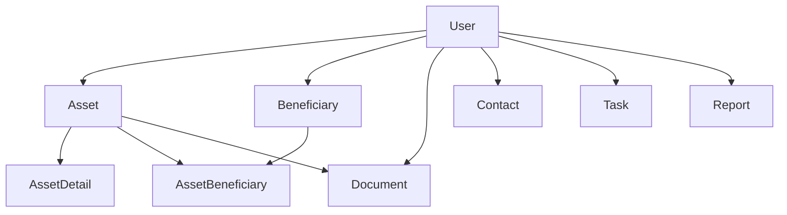

# LegacyGuard Database Model

## Overview

The LegacyGuard database is designed as a user-owned, extensible relational model for tracking legacy planning assets, documents, beneficiaries, contacts, tasks, and reports. The design separates core records from encrypted sensitive details and keeps all major entities tied to a single owning user.

## Core Principles

- Strict user ownership for all personal data
- Foreign keys and cascade rules to preserve referential integrity
- Encrypted fields for account numbers, policy numbers, and notes
- Lightweight audit fields for future audit-log integration
- Clear extension points for future modules

## Entity Summary

- User: base identity and authentication record
- Asset: top-level record for financial, legal, or personal holdings
- AssetDetail: encrypted account/policy details linked one-to-one to an asset
- Beneficiary: person or entity named for transfer purposes
- AssetBeneficiary: join table mapping assets to beneficiaries with transfer metadata
- Document: record for policy statements, legal documents, and other evidence
- Contact: important advisors, executors, agents, or employers
- Task: operational checklist items for legacy planning
- Report: generated or stored summary output

## Relationships

## Table Notes

### assets
Stores the main asset record. Categories include bank accounts, retirement accounts, investments, insurance policies, benefits, real property, vehicles, digital assets, personal property, and other custom entries.

### asset_details
Stores sensitive fields that should not be stored in clear text. These values are encrypted before persistence and decrypted only when needed.

### beneficiaries
Represents people or entities who should receive assets or information.

### asset_beneficiaries
Links assets to beneficiaries with percentage, transfer priority, and method information.

### documents
Supports evidence and important documents tied to assets or the user directly.

### important_contacts
Tracks professional or personal contacts relevant to legacy planning.

### legacy_tasks
Tracks work items such as locating documents, updating beneficiaries, or verifying account details.

### legacy_reports
Stores generated reports or narrative outputs associated with a user.

## Future Extension Guidance

New entity types can be introduced without restructuring by adding new tables that join through the user_id and asset_id relationships already established.
